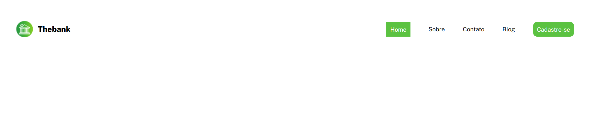
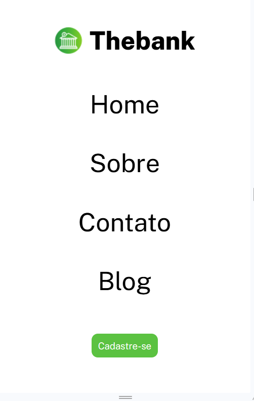

# Projeto de Prática com Flexbox - Menu Responsivo

Este repositório contém um projeto de menu responsivo desenvolvido como parte do curso **DevQuest**. O objetivo é praticar o uso do CSS Flexbox e HTML para criar um layout de navegação flexível e responsivo.

## Objetivo
Este projeto foi criado para aprimorar o entendimento do Flexbox, focando em como organizar e estilizar um menu de navegação de forma flexível e responsiva. Ele permite ajustar o layout automaticamente para diferentes tamanhos de tela, proporcionando uma melhor experiência para o usuário em dispositivos variados.

## Exemplo do Projeto
Aqui está uma prévia de como o menu fica na tela:

## Tecnologias Utilizadas
- **HTML5**
- **CSS3** (Flexbox)
- **Google Fonts** (Public Sans)

## Funcionalidades do Menu
- Um menu de navegação com links para diferentes seções (Home, Sobre, Contato, Blog e Cadastre-se).
- Estilização flexível que reorganiza o menu de acordo com o tamanho da tela, adaptando-se bem para celulares, tablets e desktops.
- Efeito de hover: ao passar o mouse sobre os links, eles alteram sua cor de fundo, proporcionando uma experiência visual mais dinâmica e interativa.

## Estrutura do Projeto
- `index.html`: Estrutura HTML principal do menu.
- `style.css`: Estilos principais e layout usando Flexbox.
- `reset.css`: Reset de estilo para uniformização.

## Responsividade
Para garantir a adaptabilidade em diferentes dispositivos, o projeto utiliza consultas de mídia (`@media`) para ajustar o layout do menu de navegação em telas menores, como tablets e celulares. 

## Estrutura dos Exercícios
Os exercícios cobrem:
- Alinhamento de itens em containers flexíveis
- Modificação de layouts de menu para responsividade usando Flexbox e consultas de mídia
- Experiência prática em organização e espaçamento dos elementos do menu

## Como Usar
Clone o repositório e abra o arquivo `index.html` em seu navegador para visualizar o menu responsivo. Experimente redimensionar a janela do navegador para observar a transição entre os diferentes layouts para desktop e dispositivos móveis.
